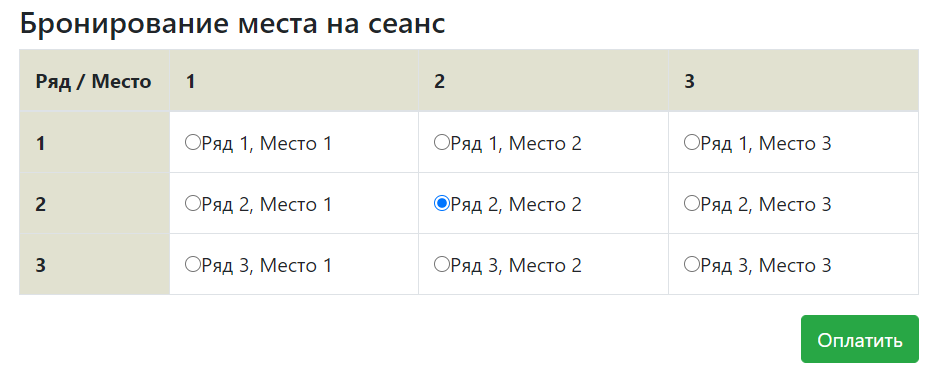
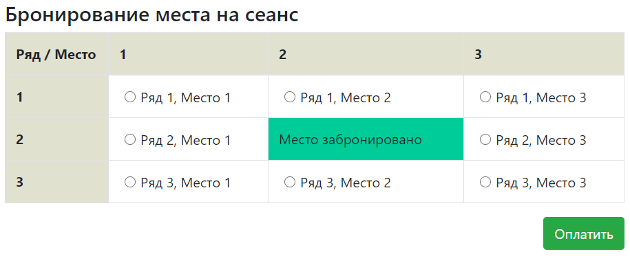
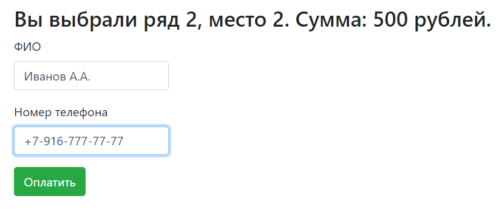
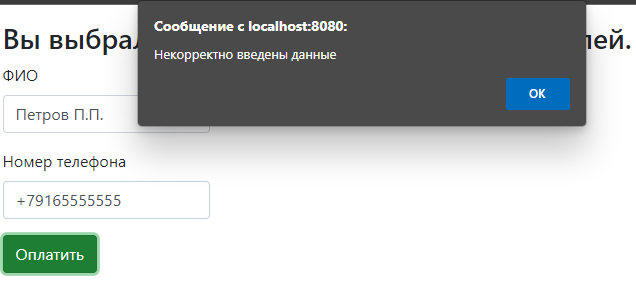
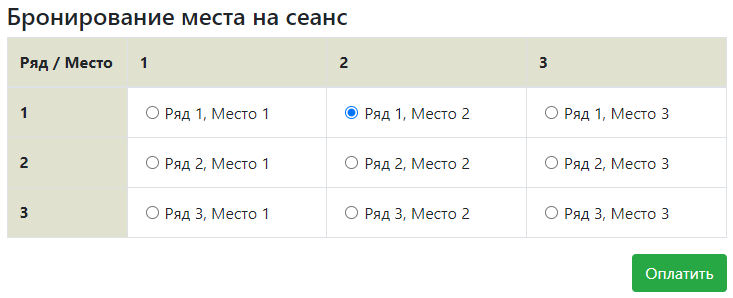
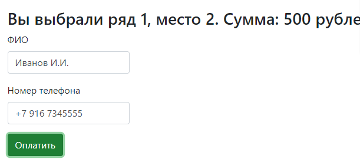
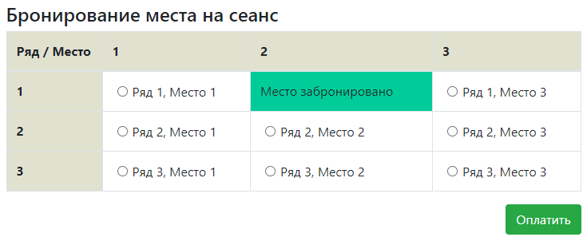
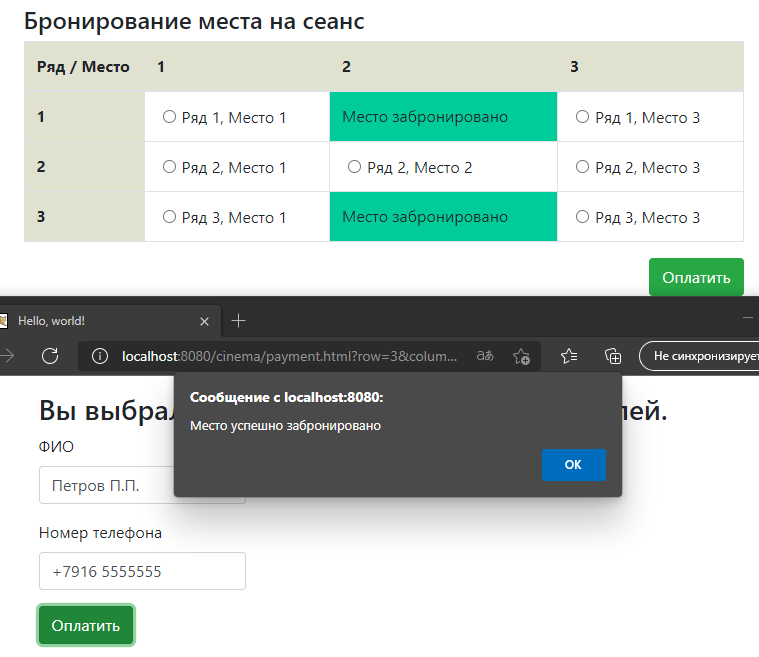

# Проект - Cinema

## О проекте

* Приложение представляет собой сервис по покупке билетов в кинотеатр. На главной странице отображается зал с рядами:
   
* Если место забронировано, то это отображается в таблице:
   
* На главной странице используется динамическое обновление контента с помощью AJAX.
* После того как пользователь выбрал место, можно перейти на страницу оплаты. Здесь указывается ФИО пользователя и его номер:
   
* Страницы реализованы на HTML и Bootstrap.
* Для корректной обработки ситуации, в которой несколько пользователей одновременно бронируют одно и то же место,
  осуществляется проверка как на стороне клиента (с помощью JS), так и на стороне сервера.
* Для работы с JSON используется библиотека GSON.
* Все запросы к серверу посылаются в виде AJAX-запросов.
* Реализована валидация вводимых пользователем данных с помощью JS:
   
* На сервере реализовано 2 слоя: слой контроллеров и слой по работе с БД. Слой контроллеров реализован на сервлетах.
  Слой по работе с БД - на JDBC.
* В качестве БД используется PostgreSQL.
* В качестве системы логирования используется slf4j.

## Сборка

Для сборки проекта необходимо:
1. Установить JDK 14.
2. Установить Maven.
3. Установить сервер БД PostgreSQL, задать логин - *postgres*, пароль - *password*.
4. Установить Tomcat.
5. Скачать исходный код проекта.
6. Перейти в корень проекта, где лежит файл `pom.xml`.
7. Собрать проект командой `mvn -DskipTests=true package`.
   При успешной сборке должна появиться папка target c `cinema-2.war`.
8. Переименовать war-архив в `cinema.war`.
9. Создать в pg_Admin БД *cinema*.
10. Открыть Query Tool для созданной БД и запустить SQL-скрипт `schema.sql`,
    находящийся в папке `db`.
11. Скопировать `cinema.war` в папку `webapps` Tomcat.
12. Скопировать файл `cinema_db.properties` в папку `bin` Tomcat.
13. Запустить сервер с помощью `startup.bat` из папки `bin` Tomcat.

## Использование

Перейдем на главную [страницу](http://localhost:8080/cinema) приложения.
Выберем место и оплатим его:

Введем необходимые данные:

Место забронировано:

Откроем [страницу](http://localhost:8080/cinema) бронирования в другом браузере, имитируя другого посетителя, и купим другой билет:
  
В первом браузере место сразу становится занятым.

## Контакты
